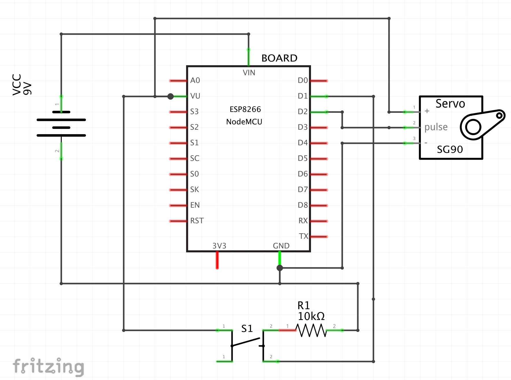

# PRInformer
Arduino project to notify when a pull request review is requested

## What you will need

Hardware:

1. Breadboard or somewhere to fit your electronics
2. ESP8266 (Any variant will be fine, this repo uses NodeMCU LoLin)
3. SG90 Servo motor, it really can be anyone but you may have to use an external power source.
4. Push button
5. Wires

Software:

1. Arduino IDE
2. ESP8266 library (Installation intructions can be found [here](https://github.com/esp8266/Arduino)
3. Adafruit IO Arduino libraries (Install via Arduino IDE Library manager)

Services:

1. Adafruit IO Account

## How to

1. Create an Adafruit IO account and then, create a Feed there.
2. Replace dummy content in the code to match your setup (WiFi settings, Adafruit username, Adafruit key, Adafruit feed, Feed MQTT name)
3. In the Feed, create a webhook receiver.
4. Copy the ```/notify``` webhook receiver URL (As we don't really want to deal with all the JSON content we will use the  ```/notify``` URL and just receive in the Feed a *ping* value).
5. In the Github repository you want to monitor go to settings, and add a Webhook (Paste there the ```/notify``` webhook URL you've copied in the previous step).
6. In the section **Which events would you like to trigger this webhook?** Select **Pull request** events to trigger your webhook. (You can select whatever you want as well).
7. Save the webhook.

Github will send a dummy payload to the webhook to test it, go to your feed and check if everything is working. If you can see the ping value in the feed data list you are ready to go.

## Wiring

Check the following schematic:


